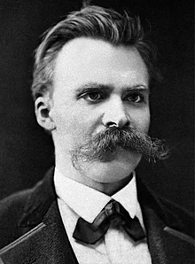

<table class="infobox biography vcard" style="width: 376px;">
<tbody>
<tr>
<th style="width: 360px;" colspan="2">

Friedrich Nietzsche

</th>
</tr>
<tr>
<td style="width: 360px;" colspan="2">

Nietzsche in&nbsp;<a title="Basel" href="https://en.wikipedia.org/wiki/Basel">Basel</a>,&nbsp;<a title="Switzerland" href="https://en.wikipedia.org/wiki/Switzerland">Switzerland</a>,&nbsp;<abbr title="circa">c.</abbr>&nbsp;1875

</td>
</tr>
<tr>
<th style="width: 84px;" scope="row">Born</th>
<td style="width: 276px;">

Friedrich Wilhelm Nietzsche

 15 October 1844 

<a title="R&ouml;cken" href="https://en.wikipedia.org/wiki/R%C3%B6cken">R&ouml;cken</a>,&nbsp;<a title="Province of Saxony" href="https://en.wikipedia.org/wiki/Province_of_Saxony">Saxony</a>,&nbsp;<a title="Kingdom of Prussia" href="https://en.wikipedia.org/wiki/Kingdom_of_Prussia">Prussia</a>

</td>
</tr>
<tr>
<th style="width: 84px;" scope="row">Died</th>
<td style="width: 276px;">25 August 1900&nbsp;(aged&nbsp;55) 

<a title="Weimar" href="https://en.wikipedia.org/wiki/Weimar">Weimar</a>,&nbsp;<a title="Saxe-Weimar-Eisenach" href="https://en.wikipedia.org/wiki/Saxe-Weimar-Eisenach">Saxe-Weimar-Eisenach</a>,&nbsp;<a title="German Empire" href="https://en.wikipedia.org/wiki/German_Empire">German Empire</a>

</td>
</tr>
<tr>
<th style="width: 84px;" scope="row">Nationality</th>
<td class="category" style="width: 276px;"><a class="mw-redirect" title="German people" href="https://en.wikipedia.org/wiki/German_people">German</a></td>
</tr>
<tr>
<th style="width: 84px;" scope="row">Alma&nbsp;mater</th>
<td style="width: 276px;">

<ul>
<li><a title="University of Bonn" href="https://en.wikipedia.org/wiki/University_of_Bonn">University of Bonn</a></li>
<li><a title="Leipzig University" href="https://en.wikipedia.org/wiki/Leipzig_University">Leipzig University</a></li>
</ul>

</td>
</tr>
<tr>
<td style="width: 360px;" colspan="2">&nbsp;</td>
</tr>
<tr>
<th style="width: 84px;" scope="row">Era</th>
<td class="category" style="width: 276px;"><a title="19th-century philosophy" href="https://en.wikipedia.org/wiki/19th-century_philosophy">19th-century philosophy</a></td>
</tr>
<tr>
<th style="width: 84px;" scope="row">Region</th>
<td class="category" style="width: 276px;"><a title="Western philosophy" href="https://en.wikipedia.org/wiki/Western_philosophy">Western philosophy</a></td>
</tr>
<tr>
<th style="width: 84px;" scope="row"><a title="List of schools of philosophy" href="https://en.wikipedia.org/wiki/List_of_schools_of_philosophy">School</a></th>
<td class="category" style="width: 276px;">

<ul>
<li><a title="Anti-foundationalism" href="https://en.wikipedia.org/wiki/Anti-foundationalism">Anti-foundationalism</a></li>
<li><a title="Anti-consumerism" href="https://en.wikipedia.org/wiki/Anti-consumerism">Anti-consumerism</a></li>
<li><a title="Atheism" href="https://en.wikipedia.org/wiki/Atheism">Atheism</a></li>
<li><a title="Continental philosophy" href="https://en.wikipedia.org/wiki/Continental_philosophy">Continental philosophy</a></li>
<li><a title="German idealism" href="https://en.wikipedia.org/wiki/German_idealism">German idealism</a></li>
<li><a title="Existentialism" href="https://en.wikipedia.org/wiki/Existentialism">Existentialism</a></li>
<li><a title="Nihilism" href="https://en.wikipedia.org/wiki/Nihilism">Nihilism</a></li>
<li><a title="Trivialism" href="https://en.wikipedia.org/wiki/Trivialism">Anti-nihilism</a></li>
<li><a title="Perspectivism" href="https://en.wikipedia.org/wiki/Perspectivism">Perspectivism</a></li>
<li><a title="Voluntarism (philosophy)" href="https://en.wikipedia.org/wiki/Voluntarism_(philosophy)">Voluntarism</a></li>
</ul>

</td>
</tr>
<tr>
<th style="width: 84px;" scope="row">Institutions</th>
<td class="org" style="width: 276px;"><a title="University of Basel" href="https://en.wikipedia.org/wiki/University_of_Basel">University of Basel</a></td>
</tr>
<tr>
<th style="width: 84px;" scope="row">Language</th>
<td style="width: 276px;"><a title="German language" href="https://en.wikipedia.org/wiki/German_language">German</a>
<ul>
<li><em><em lang="la" title="Latin language text"><a title="Amor fati" href="https://en.wikipedia.org/wiki/Amor_fati">Amor fati</a></em></em></li>
<li><a title="Apollonian and Dionysian" href="https://en.wikipedia.org/wiki/Apollonian_and_Dionysian">Apollonian and Dionysian</a></li>
<li><a title="Eternal return" href="https://en.wikipedia.org/wiki/Eternal_return">Eternal return</a></li>
<li><a title="Fact&ndash;value distinction" href="https://en.wikipedia.org/wiki/Fact%E2%80%93value_distinction">Fact&ndash;value distinction</a></li>
<li><a title="Genealogy (philosophy)" href="https://en.wikipedia.org/wiki/Genealogy_(philosophy)">Genealogy</a></li>
<li><a title="God is dead" href="https://en.wikipedia.org/wiki/God_is_dead">God is dead</a></li>
<li><a title="Herd behavior" href="https://en.wikipedia.org/wiki/Herd_behavior#Herd_behavior_in_human_societies">Herd instinct</a></li>
<li><a title="Last man" href="https://en.wikipedia.org/wiki/Last_man">Last man</a></li>
<li><a title="Master&ndash;slave morality" href="https://en.wikipedia.org/wiki/Master%E2%80%93slave_morality">Master&ndash;slave morality</a></li>
<li><a title="Nietzschean affirmation" href="https://en.wikipedia.org/wiki/Nietzschean_affirmation">Nietzschean affirmation</a></li>
<li><a title="Perspectivism" href="https://en.wikipedia.org/wiki/Perspectivism">Perspectivism</a></li>
<li><a title="Ressentiment" href="https://en.wikipedia.org/wiki/Ressentiment">Ressentiment</a></li>
<li><a title="Transvaluation of values" href="https://en.wikipedia.org/wiki/Transvaluation_of_values">Transvaluation of values</a></li>
<li><em lang="de" title="German language text"><a title="Tschandala" href="https://en.wikipedia.org/wiki/Tschandala">Tschandala</a></em></li>
<li><em><em lang="de" title="German language text"><a title="&Uuml;bermensch" href="https://en.wikipedia.org/wiki/%C3%9Cbermensch">&Uuml;bermensch</a></em></em></li>
<li><a title="Will to power" href="https://en.wikipedia.org/wiki/Will_to_power">Will to power</a></li>
</ul>
</td>
</tr>
<tr>
<th style="width: 84px;" scope="row">

Main interests

</th>
<td style="width: 276px;">

<ul>
<li><a title="Aesthetics" href="https://en.wikipedia.org/wiki/Aesthetics">Aesthetics</a></li>
<li><a class="mw-redirect" title="Classical philology" href="https://en.wikipedia.org/wiki/Classical_philology">Classical philology</a></li>
<li><a title="Ethics" href="https://en.wikipedia.org/wiki/Ethics">Ethics</a></li>
<li><a title="Metaphysics" href="https://en.wikipedia.org/wiki/Metaphysics">Metaphysics</a></li>
<li><a title="Ontology" href="https://en.wikipedia.org/wiki/Ontology">Ontology</a></li>
<li><a title="Philosophy of history" href="https://en.wikipedia.org/wiki/Philosophy_of_history">Philosophy of history</a></li>
<li><a title="Poetry" href="https://en.wikipedia.org/wiki/Poetry">Poetry</a></li>
<li><a title="Psychology" href="https://en.wikipedia.org/wiki/Psychology">Psychology</a></li>
<li><a title="Tragedy" href="https://en.wikipedia.org/wiki/Tragedy">Tragedy</a></li>
<li><a title="Value theory" href="https://en.wikipedia.org/wiki/Value_theory">Value theory</a></li>
</ul>

</td>
</tr>
<tr class="note">
<td style="width: 360px;" colspan="2">

Influences

<ul>
<li><a title="Arthur Schopenhauer" href="https://en.wikipedia.org/wiki/Arthur_Schopenhauer">Arthur Schopenhauer</a></li>
<li><a title="Baruch Spinoza" href="https://en.wikipedia.org/wiki/Baruch_Spinoza">Baruch Spinoza</a></li>
<li><a title="Charles Darwin" href="https://en.wikipedia.org/wiki/Charles_Darwin">Charles Darwin</a></li>
<li><a title="Friedrich Wilhelm Ritschl" href="https://en.wikipedia.org/wiki/Friedrich_Wilhelm_Ritschl">Friedrich Wilhelm Ritschl</a></li>
<li><a class="mw-redirect" title="Fyodor Dostoyevsky" href="https://en.wikipedia.org/wiki/Fyodor_Dostoyevsky">Fyodor Dostoyevsky</a></li>
<li><a title="Johann Gottfried Herder" href="https://en.wikipedia.org/wiki/Johann_Gottfried_Herder">Johann Gottfried Herder</a></li>
<li><a title="Johann Joachim Winckelmann" href="https://en.wikipedia.org/wiki/Johann_Joachim_Winckelmann">Johann Joachim Winckelmann</a></li>
<li><a title="Johann Wolfgang von Goethe" href="https://en.wikipedia.org/wiki/Johann_Wolfgang_von_Goethe">Johann Wolfgang von Goethe</a></li>
<li><a title="Georg Wilhelm Friedrich Hegel" href="https://en.wikipedia.org/wiki/Georg_Wilhelm_Friedrich_Hegel">Georg Wilhelm Friedrich Hegel</a></li>
<li><a title="Heraclitus" href="https://en.wikipedia.org/wiki/Heraclitus">Heraclitus</a></li>
<li><a title="Ludwig Feuerbach" href="https://en.wikipedia.org/wiki/Ludwig_Feuerbach">Ludwig Feuerbach</a></li>
<li><a title="Max Stirner" href="https://en.wikipedia.org/wiki/Max_Stirner">Max Stirner</a></li>
<li><a title="Parmenides" href="https://en.wikipedia.org/wiki/Parmenides">Parmenides</a></li>
<li><a title="Philipp Mainl&auml;nder" href="https://en.wikipedia.org/wiki/Philipp_Mainl%C3%A4nder">Philipp Mainl&auml;nder</a></li>
<li><a title="Julius Bahnsen" href="https://en.wikipedia.org/wiki/Julius_Bahnsen">Julius Bahnsen</a></li>
<li><a title="Ralph Waldo Emerson" href="https://en.wikipedia.org/wiki/Ralph_Waldo_Emerson">Ralph Waldo Emerson</a></li>
<li><a title="Richard Wagner" href="https://en.wikipedia.org/wiki/Richard_Wagner">Richard Wagner</a></li>
<li><a title="Voltaire" href="https://en.wikipedia.org/wiki/Voltaire">Voltaire</a></li>
<li><a class="mw-redirect" title="French Moralists" href="https://en.wikipedia.org/wiki/French_Moralists">French Moralists</a></li>
</ul>

</td>
</tr>
<tr class="note">
<td style="width: 360px;" colspan="2">

<ul>
<li class="NavHead">Influenced</li>
<li>

&nbsp;

</li>
<li><a class="mw-redirect" title="Theodor Adorno" href="https://en.wikipedia.org/wiki/Theodor_Adorno">Adorno</a></li>
<li><a title="Georges Bataille" href="https://en.wikipedia.org/wiki/Georges_Bataille">Bataille</a></li>
<li><a title="Hermann Broch" href="https://en.wikipedia.org/wiki/Hermann_Broch">Broch</a></li>
<li><a title="Albert Camus" href="https://en.wikipedia.org/wiki/Albert_Camus">Camus</a></li>
<li><a title="Emil Cioran" href="https://en.wikipedia.org/wiki/Emil_Cioran">Cioran</a></li>
<li><a title="Gilles Deleuze" href="https://en.wikipedia.org/wiki/Gilles_Deleuze">Deleuze</a></li>
<li><a title="Jacques Derrida" href="https://en.wikipedia.org/wiki/Jacques_Derrida">Derrida</a></li>
<li><a title="Julius Evola" href="https://en.wikipedia.org/wiki/Julius_Evola">Evola</a></li>
<li><a title="Michel Foucault" href="https://en.wikipedia.org/wiki/Michel_Foucault">Foucault</a></li>
<li><a title="Sigmund Freud" href="https://en.wikipedia.org/wiki/Sigmund_Freud">Freud</a></li>
<li><a title="Andr&eacute; Gide" href="https://en.wikipedia.org/wiki/Andr%C3%A9_Gide">Gide</a></li>
<li><a title="Adolf Hitler" href="https://en.wikipedia.org/wiki/Adolf_Hitler">Hitler</a></li>
<li><a title="Karl Jaspers" href="https://en.wikipedia.org/wiki/Karl_Jaspers">Jaspers</a></li>
<li><a title="Martin Heidegger" href="https://en.wikipedia.org/wiki/Martin_Heidegger">Heidegger</a></li>
<li><a title="Muhammad Iqbal" href="https://en.wikipedia.org/wiki/Muhammad_Iqbal">Iqbal</a></li>
<li><a title="Carl Jung" href="https://en.wikipedia.org/wiki/Carl_Jung">Jung</a></li>
<li><a title="Franz Kafka" href="https://en.wikipedia.org/wiki/Franz_Kafka">Kafka</a></li>
<li><a title="Walter Kaufmann (philosopher)" href="https://en.wikipedia.org/wiki/Walter_Kaufmann_(philosopher)">Kaufmann</a></li>
<li><a title="Nick Land" href="https://en.wikipedia.org/wiki/Nick_Land">Land</a></li>
<li><a title="Karl L&ouml;with" href="https://en.wikipedia.org/wiki/Karl_L%C3%B6with">L&ouml;with</a></li>
<li><a title="Thomas Mann" href="https://en.wikipedia.org/wiki/Thomas_Mann">Mann</a></li>
<li><a class="mw-redirect" title="H.L. Mencken" href="https://en.wikipedia.org/wiki/H.L._Mencken">Mencken</a></li>
<li><a title="Jim Morrison" href="https://en.wikipedia.org/wiki/Jim_Morrison">Morrison</a></li>
<li><a title="Robert Musil" href="https://en.wikipedia.org/wiki/Robert_Musil">Musil</a></li>
<li><a title="Jordan Peterson" href="https://en.wikipedia.org/wiki/Jordan_Peterson">Peterson</a></li>
<li><a title="Ayn Rand" href="https://en.wikipedia.org/wiki/Ayn_Rand">Rand</a></li>
<li><a title="Carl Rogers" href="https://en.wikipedia.org/wiki/Carl_Rogers">Rogers</a></li>
<li><a title="Richard Rorty" href="https://en.wikipedia.org/wiki/Richard_Rorty">Rorty</a></li>
<li><a title="Rainer Maria Rilke" href="https://en.wikipedia.org/wiki/Rainer_Maria_Rilke">Rilke</a></li>
<li><a title="Jean-Paul Sartre" href="https://en.wikipedia.org/wiki/Jean-Paul_Sartre">Sartre</a></li>
<li><a title="Lev Shestov" href="https://en.wikipedia.org/wiki/Lev_Shestov">Shestov</a></li>
<li><a title="Oswald Spengler" href="https://en.wikipedia.org/wiki/Oswald_Spengler">Spengler</a></li>
<li><a title="Leo Strauss" href="https://en.wikipedia.org/wiki/Leo_Strauss">Strauss</a></li>
<li><a title="Max Weber" href="https://en.wikipedia.org/wiki/Max_Weber">Weber</a></li>
<li><a title="Bernard Williams" href="https://en.wikipedia.org/wiki/Bernard_Williams">Williams</a></li>
<li><a title="Postchristianity" href="https://en.wikipedia.org/wiki/Postchristianity">Postchristianity</a></li>
</ul>

</td>
</tr>
<tr>
<th style="width: 360px;" colspan="2">Signature</th>
</tr>
<tr>
<td style="width: 360px;" colspan="2"></td>
</tr>
</tbody>
</table>
 

<h2>Books</h2>
<ul>

                             

 <li><a target="_blank" href="https://github.com/manjunath5496/The-Best-Nietzsche-Books/blob/master/ntz(1).pdf" style="text-decoration:none;">On the Use and Abuse of History for Life</a></li>

 <li><a target="_blank" href="https://github.com/manjunath5496/The-Best-Nietzsche-Books/blob/master/ntz(2).pdf" style="text-decoration:none;">The Case Of Wagner</a></li>

<li><a target="_blank" href="https://github.com/manjunath5496/The-Best-Nietzsche-Books/blob/master/ntz(3).pdf" style="text-decoration:none;">The Antichrist</a></li>
 <li><a target="_blank" href="https://github.com/manjunath5496/The-Best-Nietzsche-Books/blob/master/ntz(4).pdf" style="text-decoration:none;">Beyond Good and Evil</a></li>                              
<li><a target="_blank" href="https://github.com/manjunath5496/The-Best-Nietzsche-Books/blob/master/ntz(5).pdf" style="text-decoration:none;">Philosophy in the
Tragic Age of the Greeks</a></li>
<li><a target="_blank" href="https://github.com/manjunath5496/The-Best-Nietzsche-Books/blob/master/ntz(6).pdf" style="text-decoration:none;">On the Genealogy of Morality</a></li>
 <li><a target="_blank" href="https://github.com/manjunath5496/The-Best-Nietzsche-Books/blob/master/ntz(7).pdf" style="text-decoration:none;">Human, All Too Human: A Book for Free Spirits</a></li>

 <li><a target="_blank" href="https://github.com/manjunath5496/The-Best-Nietzsche-Books/blob/master/ntz(8).pdf" style="text-decoration:none;"> The Birth of Tragedy </a></li>
   <li><a target="_blank" href="https://github.com/manjunath5496/The-Best-Nietzsche-Books/blob/master/ntz(9).pdf" style="text-decoration:none;">The Will to Power</a></li>
  
   
 <li><a target="_blank" href="https://github.com/manjunath5496/The-Best-Nietzsche-Books/blob/master/ntz(10).pdf" style="text-decoration:none;">The Dionysian Vision of the World </a></li>                              
<li><a target="_blank" href="https://github.com/manjunath5496/The-Best-Nietzsche-Books/blob/master/ntz(11).pdf" style="text-decoration:none;">The Joyful Wisdom</a></li>
<li><a target="_blank" href="https://github.com/manjunath5496/The-Best-Nietzsche-Books/blob/master/ntz(12).pdf" style="text-decoration:none;"> The Complete Works of Friedrich Nietzsche</a></li>
<li><a target="_blank" href="https://github.com/manjunath5496/The-Best-Nietzsche-Books/blob/master/ntz(13).pdf" style="text-decoration:none;">The Gay Science</a></li>

<li><a target="_blank" href="https://github.com/manjunath5496/The-Best-Nietzsche-Books/blob/master/ntz(14).pdf" style="text-decoration:none;">Thus Spoke Zarathustra </a></li>

</ul>
